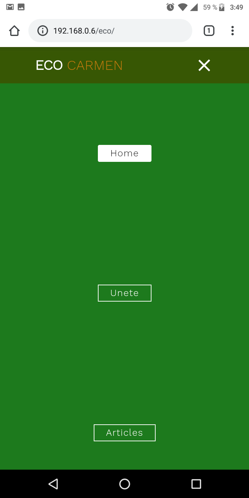
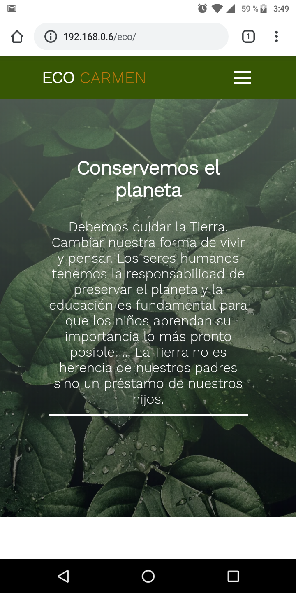

## Eco Carmen

<strong>
 Este sitio web fue desarrollado con la finalidad de llevar conciencia  y conocimientos sobre el cuidado del medio ambiente a las personas de mi comunidad.
</strong>

### Caracteristicas del sitio

<ul>
  <li>Intuitivo</li>
  <li>Moderno</li>
  <li>Informativo</li>
  <li>Sin fines lucrativos</li>
  <li>Educativo</li>
</ul>

### Objetivos del sitio

   
El sitio tiene la mision de llevar conciencia a todas las personas de mi comunidad sobre el cuidado del medio ambiente por medio de articulos informativos y faciles de entender.

  
  <h3>Deseamos promever:</h3>
   
<ul>
  <li>Conciencia ambiental.</li>
  <li>Educación.</li>
  <li>La responsabilidad ambiental.</li>
  <li>El respeto hacia los demas.</li>
  <li>Empatia por los demas.</li>
</ul>

### Resumen técnico

   
Este proyecto es simple en cuanto ha tegnologias usadas durante su desarrollo, pero ello no hace menos el esfuerzo colocado para concluir y llevar a cabo este.
   

   
   #### <a href="https://gabriel-22-01-2000.github.io/Proyecto-Eco-Carmen/" target="_blank"> Ver sitio</a>

  
   
Este proyecto o bien este sitio WEB es netamente responsive por lo que puede ser visualizado en telefonos celulares sin ninguna complicación:

   
     
   
   
  
  <h3>Tecnologias utilizadas</h3>
   
<ul>
  <li>HTML5</li>
  <li>CSS3</li>
  <li>Javascript</li>
  <li>Git</li>
</ul>

Aunque no sea la gran cosa este sitio web, me siento bien por que es algo que creado y aplicado gracias a los conocimientos obetenidos durante mi aprendizaje como autodidacta.

